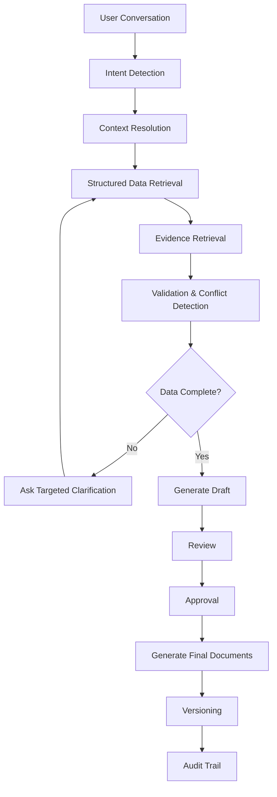
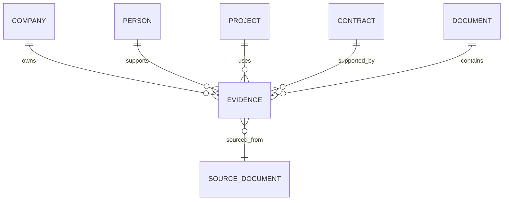
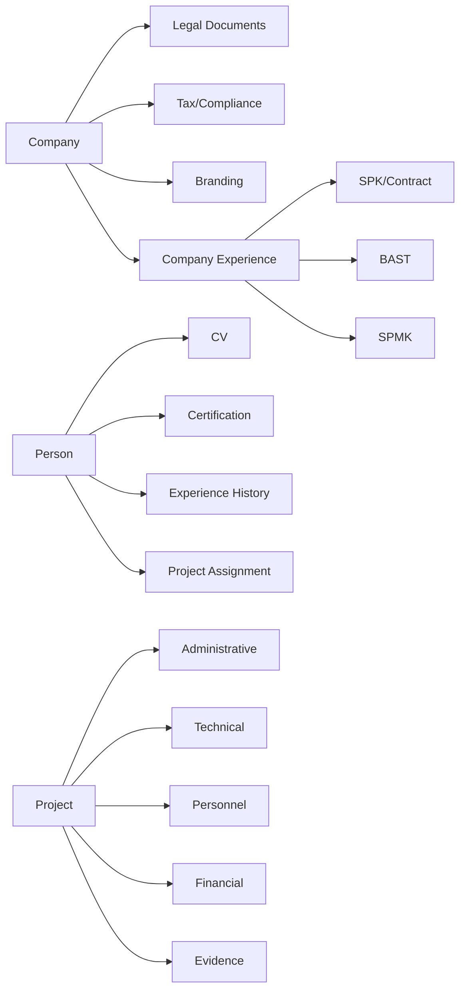
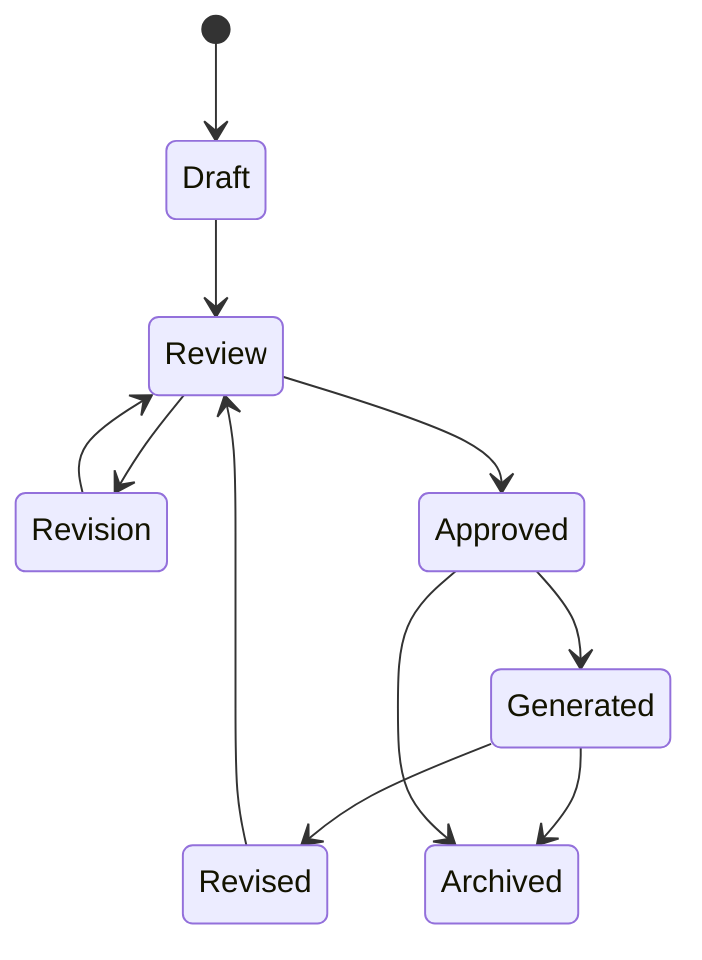
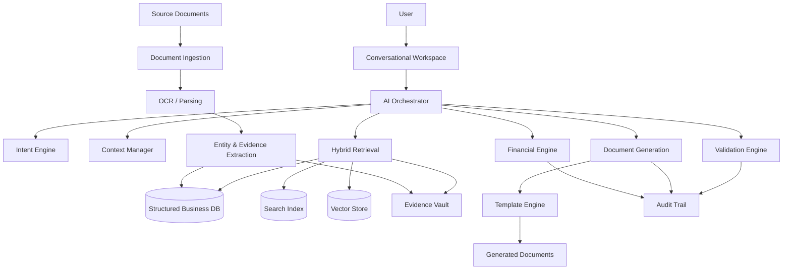
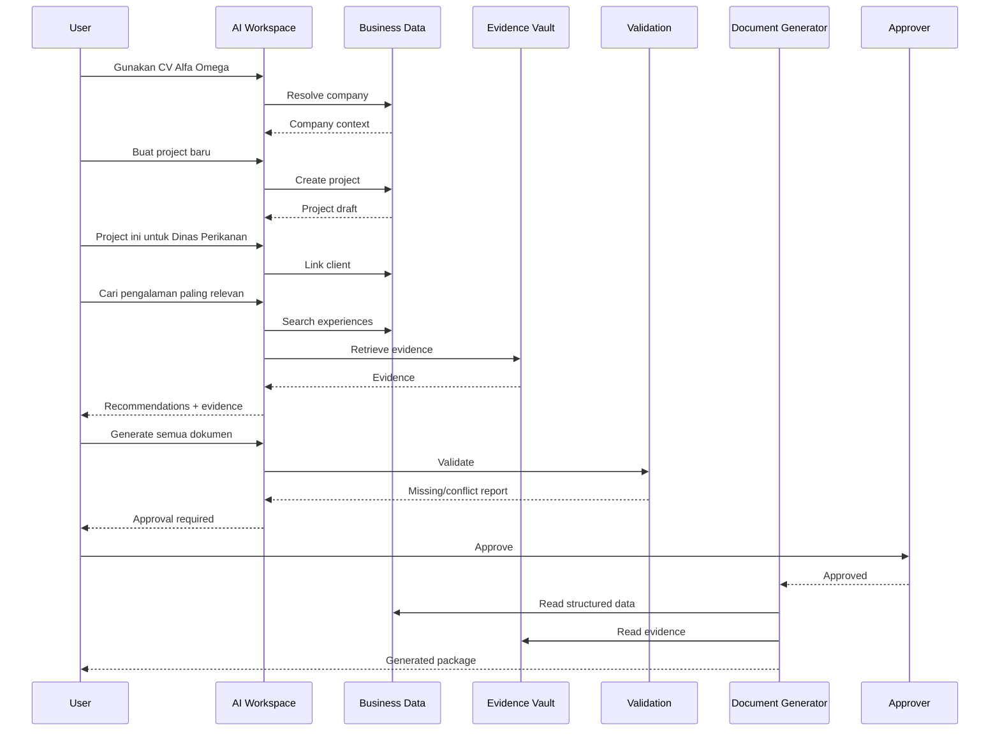

# BUSINESS REQUIREMENT DOCUMENT (BRD)

## AI-Powered Business & Procurement Knowledge Workspace

**Document Version:** 1.0  
**Status:** Draft  
**Document Type:** Business Requirement Document  
**Prepared For:** Business & Procurement Knowledge Workspace  
**Prepared By:** Product / Business Analysis  
**Date:** 2026-08-14

---

# 1. Executive Summary

Business & Procurement Knowledge Workspace adalah platform berbasis AI yang dirancang untuk mengelola pengetahuan bisnis, vendor/perusahaan, personel, proyek, pengalaman perusahaan, kontrak, legalitas, kepatuhan pajak, evidence, template, data keuangan, dan dokumen procurement dalam satu workspace terintegrasi.

Platform ini tidak diposisikan sebagai sekadar aplikasi AI untuk membuat dokumen Word. Platform menjadi **AI-powered Business Knowledge and Procurement Operating System**.

Interaksi utama dilakukan melalui percakapan natural language, sementara sistem di belakang layar mengelola structured master data, project data, evidence, provenance, retrieval, deterministic calculation, validation, approval, document generation, versioning, dan audit trail.

Prinsip utama:

> **Structured business data adalah source of truth. Dokumen adalah evidence, input, template, atau generated view dari structured data.**

Sistem harus mampu memahami perintah seperti:

- "Tambah perusahaan baru."
- "Gunakan CV Alfa Omega."
- "Buat project baru."
- "Project ini untuk Dinas Perikanan."
- "Pakai Agus sebagai Team Leader."
- "Cari pengalaman perusahaan yang paling relevan."
- "Gunakan legalitas yang masih berlaku."
- "Tambahkan BPE Juli."
- "Masukkan SPK 2022 sebagai bukti pengalaman."
- "Generate semua dokumen prakualifikasi."
- "Generate penawaran teknis."
- "Generate semua dokumen."

AI harus memahami intent, mempertahankan context, mengambil data yang relevan, memeriksa evidence, mendeteksi konflik, meminta klarifikasi hanya jika diperlukan, dan menghasilkan dokumen yang konsisten.

---

# 2. Business Problem

## 2.1 Kondisi Saat Ini

Informasi procurement dan administrasi perusahaan umumnya tersebar dalam:

- file PDF
- Word
- Excel
- scan dokumen
- CV
- kontrak/SPK
- BAST
- SPMK
- legalitas
- dokumen pajak
- template surat
- folder perusahaan
- folder proyek
- data personel
- dokumen hasil pekerjaan sebelumnya

Dokumen tersebut sering menjadi sumber informasi utama tanpa adanya master data terstruktur.

Akibatnya:

1. Data perusahaan mudah tercampur.
2. Informasi direktur/signatory dapat berbeda antar dokumen.
3. Pengalaman perusahaan sulit dicari dan dipakai ulang.
4. Riwayat personel bercampur dengan assignment proyek.
5. Legalitas yang sudah tidak berlaku dapat digunakan secara tidak sengaja.
6. Bukti pendukung sulit ditelusuri.
7. Pembuatan dokumen berulang dan manual.
8. Perubahan satu data dapat menyebabkan banyak dokumen menjadi tidak konsisten.
9. Perhitungan finansial berisiko salah jika dilakukan oleh LLM.
10. Tidak ada provenance yang jelas untuk setiap fakta.
11. Audit perubahan sulit dilakukan.
12. Pengetahuan bisnis tidak dapat digunakan secara konsisten lintas proyek.

## 2.2 Root Cause

Masalah utama bukan sekadar kurangnya template dokumen.

Root cause adalah tidak adanya **centralized structured business knowledge model** yang menghubungkan:

Company → People → Projects → Experience → Contracts → Compliance → Evidence → Templates → Documents → Validation → Approval → Audit.

---

# 3. Business Objectives

## 3.1 Primary Objectives

1. Membangun single source of truth untuk data bisnis dan procurement.
2. Memisahkan data antar perusahaan/vendor secara ketat.
3. Mengelola personel sebagai global entities dengan employment/association history.
4. Membangun repository pengalaman perusahaan yang dapat dicari dan digunakan kembali.
5. Mengubah dokumen menjadi structured evidence.
6. Menyimpan provenance setiap fakta penting.
7. Mendeteksi konflik data sebelum dokumen dihasilkan.
8. Memastikan hanya evidence yang valid dan sesuai konteks yang digunakan.
9. Mengotomatisasi pembuatan paket dokumen procurement.
10. Menyediakan deterministic financial calculation.
11. Menyediakan conversational user experience.
12. Menyediakan versioning, approval, dan audit trail.

## 3.2 Secondary Objectives

- Mengurangi waktu penyusunan dokumen.
- Mengurangi kesalahan copy-paste.
- Meningkatkan traceability.
- Meningkatkan reuse knowledge.
- Mempercepat pencarian evidence.
- Meningkatkan konsistensi antar dokumen.
- Memudahkan review dan approval.

---

# 4. Business Scope

## 4.1 In Scope

Platform mencakup:

- Company/Vendor Management
- Company Master Data
- People Master
- Employment/Association History
- Personnel Management
- Project Management
- Project Assignment
- Company Experience Repository
- Contract/SPK Repository
- Compliance & Tax Evidence
- Evidence Vault
- Document Management
- Template Management
- Document Generation
- Conversational AI
- Search
- RAG / Knowledge Retrieval
- Validation
- Provenance
- Temporal Validity
- Financial Calculation
- Approval Workflow
- Versioning
- Audit Trail
- Security & Access Control
- Reporting
- AI recommendation

## 4.2 Out of Scope untuk MVP

- Sistem akuntansi penuh.
- Payroll.
- ERP penuh.
- E-procurement marketplace.
- Sistem pengadaan pemerintah eksternal.
- Legal advice otomatis.
- Penetapan status hukum tanpa evidence.
- Penghitungan finansial final berbasis LLM tanpa deterministic engine.

---

# 5. Stakeholders

| Stakeholder | Kepentingan | Tanggung Jawab |
|---|---|---|
| Business Owner | Tinggi | Menentukan arah bisnis |
| Procurement/Admin | Tinggi | Mengelola dokumen dan submission |
| Company/Vendor Manager | Tinggi | Mengelola data perusahaan |
| Project Manager | Tinggi | Mengelola project dan personel |
| Finance | Tinggi | Mengelola biaya dan perhitungan |
| Legal/Compliance | Tinggi | Memverifikasi legalitas dan compliance |
| HR/Personnel Admin | Sedang-Tinggi | Mengelola personel |
| Document Reviewer | Tinggi | Review hasil dokumen |
| Approver | Tinggi | Memberikan approval |
| System Administrator | Tinggi | Mengelola sistem |
| Auditor | Sedang | Meninjau audit trail |
| AI/Platform Administrator | Tinggi | Mengelola AI, retrieval, dan konfigurasi |

---

# 6. Initial Company Context

Sistem harus mendukung banyak perusahaan independen.

Initial company records:

1. PT EZRA PRATAMA
2. CV SOLUSI BUMI PERSADA
3. CV ALFA OMEGA SOLUSINDO
4. CV STIGMA PRATAMA

Data setiap perusahaan harus terisolasi.

Data berikut tidak boleh tercampur antar perusahaan:

- identity
- director
- ownership
- legal documents
- tax records
- letterhead
- signatures
- bank/account information
- personnel assignment
- project history
- company experience
- contract evidence

---

# 7. Current Process

Secara umum proses bisnis saat ini diasumsikan sebagai berikut:

```text
User menerima kebutuhan procurement
        ↓
Mencari file perusahaan
        ↓
Mencari legalitas
        ↓
Mencari pengalaman
        ↓
Mencari personel
        ↓
Mencari kontrak/SPK/BAST
        ↓
Copy data ke template
        ↓
Mengubah dokumen satu per satu
        ↓
Melakukan pengecekan manual
        ↓
Review
        ↓
Revisi
        ↓
Generate final package
```

Masalah pada proses tersebut adalah ketergantungan pada pencarian manual, copy-paste, dan pengetahuan individu.

---

# 8. Proposed Business Process



---

# 9. Business Requirements

## BR-001 — Multi-Company Management

**Description:** Sistem harus dapat mengelola banyak perusahaan secara independen.

**Priority:** MUST

**Acceptance Criteria:**

- Given user memilih perusahaan A,
- When user meminta data perusahaan,
- Then sistem hanya mengambil data yang berada dalam scope perusahaan A.

- Given perusahaan A dan B memiliki personel bernama sama,
- When user meminta pengalaman perusahaan A,
- Then pengalaman perusahaan B tidak boleh ditampilkan sebagai pengalaman perusahaan A.

---

## BR-002 — Structured Master Data

Sistem harus menyimpan structured business data sebagai source of truth.

**Priority:** MUST

Data minimal mencakup:

- company
- people
- projects
- clients
- experience
- contracts
- compliance
- evidence
- documents
- templates
- financial data

---

## BR-003 — Global Person Entity

Person harus menjadi entity global dan tidak secara permanen melekat pada satu perusahaan.

**Priority:** MUST

Person dapat memiliki:

```text
Person
 ├── Employment Company A
 ├── Employment Company B
 ├── Consultant Company C
 └── Project Assignments
```

Riwayat personel tidak boleh otomatis menjadi pengalaman perusahaan aktif.

---

## BR-004 — Employment History

Sistem harus menyimpan:

- person
- company
- role
- employment status
- start date
- end date
- evidence
- source document

Status:

- Permanent
- Contract
- Non-permanent
- Consultant
- External
- Other

---

## BR-005 — Project Assignment

Assignment harus dipisahkan dari historical experience.

Field minimal:

- project
- company
- person
- proposed position
- role
- responsibilities
- allocation
- start date
- end date
- duration
- status
- evidence

---

## BR-006 — Company Experience Repository

Sistem harus menyediakan repository pengalaman perusahaan yang reusable.

Data minimal:

- company
- project
- client
- location
- contract number
- contract date
- contract value
- start date
- end date
- handover date
- completion percentage
- procurement category
- scope
- client address
- contract evidence
- SPK evidence
- SPMK evidence
- BAST/reference evidence

---

## BR-007 — Evidence-Based Experience

Setiap pengalaman perusahaan harus dapat ditelusuri ke evidence.

Contoh:

```text
Company Experience
    ↓
SPK
    ↓
Contract
    ↓
BAST
```

Sistem tidak boleh menciptakan pengalaman yang tidak memiliki dukungan evidence.

---

## BR-008 — Contract Knowledge

SPK/contract harus diperlakukan sebagai structured knowledge.

Informasi yang harus dapat diekstrak:

- contract number
- date
- project
- client
- PPK
- provider
- contract type
- value
- duration
- start/end date
- location
- scope
- payment information
- penalty
- deliverables
- signatories

---

## BR-009 — Compliance Repository

Sistem harus mendukung:

- BPE
- SPT
- NPWP evidence
- tax payment evidence
- NIB
- SIUP
- TDP
- SBU
- deed
- other compliance documents

Setiap record memiliki:

- company
- evidence type
- document number
- issue date
- tax period
- valid-from
- valid-until
- status
- source
- source page
- extracted fields
- verification state


## BR-009A — Compliance Recurring Schedule

Sistem harus mendukung **recurring compliance evidence** sehingga kebutuhan dokumen yang berulang dapat dipantau dan tidak hanya disimpan sebagai file statis.

### 1. Surat Keterangan Bank

Surat Keterangan Bank harus dapat dikonfigurasi sebagai dokumen/evidence yang:

- diminta/diperbarui **1 kali setiap tahun**;
- secara default dijadwalkan pada **awal tahun, terutama bulan Januari**;
- dikaitkan dengan perusahaan;
- menyimpan tanggal penerbitan;
- menyimpan periode/tahun dokumen;
- menyimpan bank penerbit;
- menyimpan nomor surat jika tersedia;
- menyimpan source document;
- memiliki status validitas;
- menghasilkan reminder ketika dokumen tahun berjalan belum tersedia.

**Business Rule:**

> Untuk kebutuhan operasional sistem, Surat Keterangan Bank dianggap sebagai recurring annual evidence dengan target pembaruan awal tahun (default Januari). Jadwal dapat dikonfigurasi jika kebutuhan proyek atau perusahaan berbeda.

### 2. BPE

BPE (Bukti Penerimaan Elektronik) harus dapat dikelola sebagai recurring tax evidence.

Default business cycle:

- **1 kali setiap bulan**;
- setiap BPE harus memiliki tax year;
- setiap BPE harus memiliki tax period;
- tanggal penerimaan harus disimpan;
- nomor BPE harus disimpan jika tersedia;
- source document harus disimpan;
- status verifikasi harus tersedia.

Sistem harus dapat menampilkan:

```text
BPE 2026
├── Januari
├── Februari
├── Maret
├── April
├── ...
└── Desember
```

Sistem harus dapat mendeteksi:

- BPE bulan berjalan belum tersedia;
- BPE bulan tertentu missing;
- BPE duplicate;
- BPE dengan periode tidak sesuai;
- BPE dengan data perusahaan/NPWP yang tidak sesuai;
- BPE yang belum diverifikasi.

### 3. Laporan Tahunan Pajak

Laporan tahunan pajak harus dapat dikelola sebagai recurring annual tax evidence.

Default business cycle:

- **1 kali setiap tahun**;
- sistem membuat kewajiban tahunan berdasarkan tax year;
- target penyelesaian default dapat dikonfigurasi pada **bulan April**;
- status dapat berupa `MISSING`, `DRAFT`, `SUBMITTED`, `CONFIRMED`, atau `UNVERIFIED`;
- source document dan tanggal pelaporan harus disimpan.

**Catatan penting:** tanggal jatuh tempo aktual tidak boleh di-hard-code sebagai fakta hukum. Sistem harus menyediakan konfigurasi deadline berdasarkan jenis wajib pajak, jenis pelaporan, periode pajak, dan aturan yang berlaku. Jika pengguna menetapkan April sebagai operational target, sistem menggunakan April sebagai target internal sampai deadline resmi dikonfigurasi/terverifikasi.

### 4. Compliance Calendar

Sistem harus menyediakan Compliance Calendar yang menampilkan:

| Evidence | Frekuensi | Default Target | Scope |
|---|---|---|---|
| Surat Keterangan Bank | Tahunan | Januari | Perusahaan |
| BPE | Bulanan | Setiap bulan | Perusahaan/Tax |
| Laporan Tahunan Pajak | Tahunan | April sebagai target operasional | Perusahaan/Tax |

Calendar harus mendukung:

- due date;
- operational target date;
- actual submission date;
- verification date;
- status;
- responsible person;
- reminder;
- escalation;
- source evidence;
- notes.

### 5. Compliance Status

Status compliance minimum:

- `UPCOMING`
- `DUE`
- `OVERDUE`
- `MISSING`
- `SUBMITTED`
- `VERIFIED`
- `EXPIRED`
- `CONFLICTED`
- `UNVERIFIED`

### 6. Recurring Compliance Reminder

Sistem harus dapat membuat reminder berdasarkan jadwal evidence.

Contoh:

```text
Januari 2027
→ Surat Keterangan Bank CV Alfa Omega belum tersedia

Agustus 2026
→ BPE Juli 2026 belum diverifikasi

April 2027
→ Laporan Tahunan Pajak Tahun 2026 belum tersedia
```

Reminder harus memiliki:

- company
- evidence type
- period
- target date
- responsible user
- status
- escalation level
- related project, jika ada
- related source evidence, jika sudah tersedia

### 7. Project Dependency

Recurring compliance evidence pada dasarnya merupakan **Company Compliance Knowledge**, bukan project document.

Namun, project dapat membuat dependency terhadap evidence tertentu.

Contoh:

```text
Company Compliance
    ↓
BPE Juli 2026
    ↓
Project A requires current tax evidence
    ↓
Validation
    ↓
PASS / MISSING / EXPIRED / UNVERIFIED
```

Dengan demikian, satu evidence dapat digunakan oleh beberapa project tanpa membuat salinan data yang berbeda.


---

## BR-010 — Evidence Vault

Setiap fakta penting harus memiliki evidence relationship.

Contoh:

```text
Director ← Deed
NIB ← Legal Document
NPWP ← Tax Document
Experience ← SPK
Certification ← Certificate
Tax Compliance ← BPE
```

---

## BR-011 — Provenance

Setiap extracted value harus memiliki:

- source file
- page
- section
- table
- source field
- extraction timestamp
- confidence
- verification status

---

## BR-012 — Evidence State

Sistem harus mendukung status:

- CONFIRMED
- SUPPORTED
- INFERRED
- ASSUMED
- MISSING
- CONFLICTED
- EXPIRED
- UNVERIFIED
- POTENTIALLY OUTDATED

---

## BR-013 — Temporal Validity

Data sensitif harus mendukung effective dating.

Contoh:

- director valid from/to
- employment start/end
- address start/end
- tax year/period
- document validity
- historical company profile

Ketika membuat dokumen historis, sistem harus menggunakan context historis yang sesuai jika tersedia.

---

## BR-014 — Document Management

Sistem harus mendukung kategori:

### Administrative

- Surat Penawaran
- Pakta Integritas
- Surat Pernyataan
- Surat Minat
- Surat Prakualifikasi
- Formulir Isian Kualifikasi
- Legalitas

### Technical

- Penawaran Teknis
- Metodologi dan Pendekatan
- Pengalaman Perusahaan
- Kualifikasi Tenaga Ahli
- Jadwal Penugasan
- Struktur Organisasi
- Manajemen Risiko
- Rencana Kerja

### Personnel

- CV
- Daftar Riwayat Hidup
- Surat Kesediaan
- Surat Penugasan
- Sertifikat
- Ijazah
- Referensi

### Financial

- Surat Penawaran Harga
- Rekapitulasi Biaya
- Daftar Kuantitas dan Harga
- Komponen Remunerasi
- RAB
- Pajak

### Evidence / Contract

- SPK
- SPMK
- BAST
- Contract Evidence
- Tax Evidence
- Legal Evidence

### Reporting

- Laporan Pendahuluan
- Laporan Akhir
- Manual Book
- Other Deliverables

---

# 10. Business Rules

## BRULE-001 — No Cross-Company Leakage

Data perusahaan tidak boleh muncul pada company scope yang berbeda kecuali terdapat relationship yang eksplisit dan diizinkan.

## BRULE-002 — Historical Experience Ownership

Pengalaman personel pada perusahaan sebelumnya tidak otomatis menjadi pengalaman perusahaan saat ini.

## BRULE-003 — Evidence Required

Critical claims harus memiliki evidence atau berstatus MISSING/UNVERIFIED.

## BRULE-004 — Conflict Must Not Be Silently Resolved

Jika dua sumber memiliki nilai berbeda, sistem harus menandainya sebagai CONFLICTED.

## BRULE-005 — Generated Document Is Not Source of Truth

Perubahan generated document tidak boleh secara otomatis mengubah master data tanpa proses ekstraksi/approval yang eksplisit.

## BRULE-006 — Expired Evidence

Evidence expired tidak boleh digunakan untuk requirement yang mensyaratkan evidence valid.

## BRULE-007 — LLM Is Not Final Calculator

Semua perhitungan finansial final harus menggunakan deterministic calculation engine.

## BRULE-008 — Historical Document Context

Dokumen dengan tanggal historis harus menggunakan data yang valid pada periode tersebut bila evidence tersedia.

---

# 11. Company/Vendor Model

## 11.1 Company Profile

Minimal:

- legal name
- business type
- address
- phone
- email
- website
- directors
- commissioners
- partners
- owners
- ownership percentage
- legal documents
- tax records
- assets
- services
- branding

## 11.2 Branding

Mendukung:

- logo
- letterhead
- signature
- stamp
- footer
- numbering pattern

---

# 12. Project Model

Project minimal memiliki:

- project name
- client
- location
- procurement category
- scope
- project dates
- company
- assigned personnel
- selected experience
- required documents
- financial data
- status

Project status:

- Draft
- Active
- Review
- Approved
- Submitted
- Completed
- Archived

---

# 13. Personnel Model

Personnel master menyimpan:

- full name
- academic title
- position
- birth data
- education
- non-formal education
- languages
- skills
- certifications
- employment history
- project history
- references
- CV
- identity documents
- supporting evidence

---

# 14. Evidence Model

Evidence harus menjadi entity first-class.



---

# 15. Document Relationship Model



---

# 16. Template Management

Template harus terpisah dari business data.

Template mendukung:

- header
- logo
- letterhead
- footer
- tables
- signature
- stamp
- page numbering
- dynamic sections
- conditional sections
- repeating sections
- number formatting
- date formatting

Template harus memiliki versioning.

Project dapat memilih template version tertentu.

---

# 17. Conversational UX

## 17.1 Context

Sistem harus mempertahankan:

- CURRENT COMPANY
- CURRENT PROJECT
- CURRENT CLIENT
- CURRENT PERSON
- CURRENT DOCUMENT
- CURRENT VERSION

Contoh:

```text
Company:
CV Alfa Omega Solusindo

Project:
Kaji Terap Automatic Feeder Berbasis Teknologi IoT

Client:
Dinas Perikanan Kota Semarang
```

Jika user berkata:

> "buat suratnya"

sistem harus menggunakan current context.

Jika lebih dari satu context memungkinkan, sistem meminta klarifikasi.

---

# 18. Intent Detection

Intent minimal:

- create
- update
- delete
- add
- use
- select
- search
- compare
- validate
- generate
- revise
- switch company
- switch project
- switch person
- reuse historical data
- recommend

AI tidak boleh meminta form panjang jika informasi dapat diambil dari context dan repository.

---

# 19. Document Analysis

Saat file diunggah, sistem harus melakukan:

1. Entity extraction
2. Attribute extraction
3. Relationship extraction
4. Business rule detection
5. Evidence extraction
6. Template detection
7. Layout analysis
8. Calculation extraction
9. Signature detection
10. Validation rule extraction
11. Temporal extraction
12. Conflict detection

Output analisis harus masuk ke structured knowledge layer.

---

# 20. Consistency Engine

Sebelum menghasilkan package, sistem harus memeriksa:

- company
- director
- signatory
- NPWP
- NIB
- address
- client
- project
- location
- fiscal year
- dates
- duration
- personnel
- position
- experience
- contract value
- costs
- tax
- reference numbers
- evidence

Contoh:

```text
Document A:
Director = Director A

Document B:
Director = Director B

Result:
CONFLICT

Action:
Do not automatically choose one.
Request verification.
```

---

# 21. Financial Engine

Financial engine harus deterministic.

Support:

- quantity
- unit
- unit price
- duration
- person-month
- billing rate
- personnel cost
- non-personnel cost
- tax
- total
- rounding
- number-to-words

Setiap calculation harus dapat direproduksi.

---

# 22. Package Generation

User dapat meminta:

> "Generate paket lengkap."

Sistem menentukan dokumen yang diperlukan berdasarkan project configuration.

Package:

```text
Administrative
+
Technical
+
Personnel
+
Financial
+
Evidence
```

Sebelum final generation:

1. Validate
2. Detect conflicts
3. Show missing fields
4. Show expired evidence
5. Show unsupported claims
6. Ask approval
7. Generate
8. Version
9. Audit

---

# 23. AI Experience Matching

AI dapat merekomendasikan:

- company experience
- personnel
- certifications
- legal evidence
- document template
- contract evidence

Setiap recommendation harus menjelaskan:

- Why selected
- Supporting evidence
- Missing evidence
- Confidence

AI tidak boleh menyatakan recommendation sebagai fakta final.

---

# 24. Search Requirements

Search harus mendukung:

1. Keyword search
2. Semantic search
3. Structured filtering
4. Hybrid search

Contoh:

> Cari pengalaman AOS terkait sistem informasi tahun 2020-2025.

> Siapa programmer yang punya pengalaman aplikasi pemerintah?

> Tampilkan semua SPK AOS.

> Dokumen pajak AOS yang tersedia tahun 2026?

---

# 25. Knowledge Separation

Knowledge harus dipisahkan menjadi:

- COMPANY KNOWLEDGE
- PROJECT KNOWLEDGE
- PERSON KNOWLEDGE
- CONTRACT KNOWLEDGE
- COMPLIANCE KNOWLEDGE
- TEMPLATE KNOWLEDGE
- GENERATED DOCUMENT KNOWLEDGE

Tidak boleh menggabungkan semuanya ke satu unstructured knowledge base.

---

# 26. Approval Workflow



Approval minimal menyimpan:

- approver
- timestamp
- action
- comment
- version
- affected documents

---

# 27. Audit Trail

Audit harus menyimpan:

- who
- what changed
- when
- before
- after
- why
- source
- affected documents

Contoh:

```text
User changes project value
        ↓
Financial recalculation
        ↓
Rekap updated
        ↓
Offer Letter affected
        ↓
RAB affected
        ↓
Audit event created
```

---

# 28. Versioning

Status:

- Draft
- Review
- Approved
- Generated
- Revised
- Archived

Historical versions tidak boleh dihancurkan.

---

# 29. Security Requirements

Sistem harus menyediakan:

- tenant isolation
- role-based access control
- company-level permissions
- project-level permissions
- document-level permissions
- sensitive attachment protection
- encryption
- secure document access
- version integrity
- audit logging

Data sensitif harus dibatasi berdasarkan least privilege.

---

# 30. Non-Functional Requirements

## NFR-001 Performance

Target awal:

- conversational response untuk operasi ringan: ≤ 5 detik target
- structured search: ≤ 3 detik target
- retrieval kompleks: ≤ 8 detik target
- document generation: asynchronous untuk package besar

Target harus divalidasi melalui load testing.

## NFR-002 Availability

Target MVP production:

- ≥ 99.5% monthly availability

Target lanjutan dapat dinaikkan berdasarkan kebutuhan bisnis.

## NFR-003 Scalability

Sistem harus dapat meningkatkan kapasitas secara horizontal untuk:

- API
- AI orchestration
- document processing
- retrieval
- generation
- background jobs

## NFR-004 Security

- encryption in transit
- encryption at rest
- RBAC
- tenant isolation
- audit logging
- secure file access

## NFR-005 Reliability

Job document generation harus idempotent dan dapat di-retry.

## NFR-006 Auditability

Setiap perubahan penting harus dapat ditelusuri.

## NFR-007 Maintainability

Business rules harus dapat dikonfigurasi tanpa perubahan kode besar jika memungkinkan.

## NFR-008 Accessibility

UI harus mempertimbangkan keyboard navigation, readable contrast, semantic labels, dan accessible forms.

## NFR-009 Localization

Minimal mendukung:

- Bahasa Indonesia
- format tanggal Indonesia
- currency IDR
- number formatting Indonesia

## NFR-010 Observability

Sistem harus menyediakan:

- application logs
- audit logs
- metrics
- tracing
- AI telemetry
- document processing telemetry
- retrieval metrics

---

# 31. High-Level Data Model

Minimal entities:

```text
users
organizations

companies
company_identity
company_owners
company_directors
company_legal_documents
company_tax_records
company_compliance_evidence
company_assets
company_services

people
person_identity
person_education
person_certifications
person_employment_history
person_experience

projects
clients
locations
project_assignments
project_experience_links

company_experiences

contracts
contract_parties
contract_deliverables
contract_evidence

documents
document_templates
document_versions
document_dependencies

financial_items
financial_calculations
tax_rules

attachments
source_documents
source_evidence

approvals
audit_logs
```

---

# 32. High-Level Architecture



---

# 33. AI Capability Requirements

Setiap AI capability harus didefinisikan dengan:

- Purpose
- Input
- Output
- Context
- Retrieval
- Model
- Prompt Strategy
- Tools
- Validation
- Confidence
- Evaluation
- Failure Modes
- Human Approval
- Latency
- Cost
- Observability

## AI Capabilities

### AI-001 Intent Detection

Mengidentifikasi tindakan user.

### AI-002 Context Resolution

Menentukan company/project/person/document aktif.

### AI-003 Document Understanding

Mengubah dokumen menjadi structured data dan evidence.

### AI-004 Evidence Retrieval

Mencari evidence pendukung.

### AI-005 Experience Matching

Memilih pengalaman paling relevan berdasarkan evidence.

### AI-006 Personnel Matching

Memilih personel berdasarkan qualification dan evidence.

### AI-007 Conflict Detection

Mendeteksi nilai yang bertentangan.

### AI-008 Document Composition

Menghasilkan dokumen berdasarkan structured data dan template.

### AI-009 Conversational Guidance

Meminta hanya informasi yang benar-benar missing atau ambiguous.

---

# 34. AI Guardrails

AI wajib:

- tidak mengarang data
- tidak mengarang pengalaman
- tidak mengarang nomor kontrak
- tidak mengarang nilai kontrak
- tidak mengarang sertifikasi
- tidak mengarang legal status
- tidak mengarang client
- tidak mengarang project requirement

Status unsupported:

```text
MISSING
```

Contradiction:

```text
CONFLICT
```

Inference:

```text
INFERRED
```

Outdated:

```text
POTENTIALLY OUTDATED
```

Unverified:

```text
UNVERIFIED
```

---

# 35. Risks

| ID | Risk | Impact | Probability | Mitigation |
|---|---|---:|---:|---|
| R-001 | Data antar perusahaan tercampur | Critical | Medium | Tenant/company isolation |
| R-002 | AI hallucination | Critical | Medium | Evidence + validation + approval |
| R-003 | Dokumen outdated digunakan | High | Medium | Temporal validity |
| R-004 | Konflik data tidak terdeteksi | High | Medium | Consistency engine |
| R-005 | Financial calculation salah | Critical | Medium | Deterministic engine |
| R-006 | Sensitive document leakage | Critical | Medium | RBAC + encryption |
| R-007 | OCR extraction error | High | High | Confidence + human verification |
| R-008 | Template menghasilkan dokumen salah | High | Medium | Template versioning + automated validation |
| R-009 | User terlalu bergantung pada AI | Medium | Medium | Approval workflow |
| R-010 | Knowledge repository menjadi tidak konsisten | High | Medium | Governance + source provenance |
| R-011 | Recurring compliance evidence terlewat | High | Medium | Compliance calendar + reminders |
| R-012 | Operational deadline disalahartikan sebagai legal deadline | High | Medium | Configurable deadline + explicit labeling |

---

# 36. Assumptions

1. User memiliki hak akses terhadap data yang dimasukkan.
2. Source documents dapat diproses secara digital atau melalui OCR.
3. Business owner menyediakan template yang sah untuk digunakan.
4. Data master akan melalui proses verification.
5. Financial rules akan dikonfigurasi secara deterministic.
6. Dokumen yang tidak memiliki evidence akan ditandai sesuai statusnya.
7. AI hanya bertindak sebagai assistant/recommender dan tidak menggantikan approval manusia.

---

# 37. Constraints

1. Data perusahaan bersifat sensitif.
2. Dokumen dapat memiliki format dan kualitas berbeda.
3. OCR dapat menghasilkan kesalahan.
4. Informasi historis mungkin tidak lengkap.
5. Tidak semua evidence memiliki tanggal validitas.
6. Template procurement dapat berbeda antar proyek.
7. Requirement procurement dapat berbeda sesuai project.
8. Sistem tidak boleh mengasumsikan regulasi yang tidak diberikan.

---

# 38. Success Metrics

## Business Metrics

- Pengurangan waktu pembuatan package procurement.
- Pengurangan jumlah data inconsistency.
- Pengurangan manual copy-paste.
- Peningkatan reuse company experience.
- Peningkatan reuse personnel profile.
- Peningkatan evidence traceability.

## Product Metrics

- Intent recognition accuracy
- Context resolution accuracy
- Retrieval precision
- Evidence linkage accuracy
- Conflict detection recall
- Document generation success rate
- Human approval rate
- User correction rate

## AI Metrics

- Hallucination rate
- Unsupported claim rate
- Citation/evidence coverage
- Recommendation precision
- Extraction accuracy
- Confidence calibration

---

# 39. MVP Scope

## MVP Phase 1

### Must Have

- Multi-company
- Company master
- Person master
- Employment history
- Project master
- Project assignment
- Experience repository
- Contract repository
- Compliance evidence
- Evidence vault
- Provenance
- Basic hybrid search
- Conversational interface
- Validation
- Conflict detection
- Document template
- Basic document generation
- Versioning
- Audit trail
- RBAC

### Should Have

- AI experience matching
- AI personnel matching
- Financial calculation engine
- Approval workflow
- Semantic search
- OCR

### Could Have

- Advanced recommendations
- Automated package composition
- Advanced document layout analysis
- Advanced AI evaluation dashboard

### Won't Have in MVP

- Full ERP
- Full accounting
- Payroll
- External procurement platform integration
- Autonomous legal decision-making

---

# 40. MVP End-to-End Scenario



---

# 41. Acceptance Criteria — End-to-End

### AC-001 Company Isolation

**Given** terdapat Company A dan Company B  
**When** user berada pada Company A  
**Then** retrieval tidak boleh menggunakan data Company B kecuali relationship eksplisit diizinkan.

### AC-002 Evidence Provenance

**Given** sebuah field diekstrak dari PDF  
**When** user membuka detail field  
**Then** sistem dapat menunjukkan source file dan source page jika tersedia.

### AC-003 Conflict

**Given** dua dokumen memiliki director berbeda  
**When** user meminta generate package  
**Then** sistem menandai CONFLICT dan tidak memilih salah satu secara otomatis.

### AC-004 Expired Evidence

**Given** evidence memiliki status EXPIRED  
**When** requirement membutuhkan evidence aktif  
**Then** evidence tidak boleh digunakan sebagai valid evidence.

### AC-005 Historical Person

**Given** person pernah bekerja di Company A  
**When** person ditugaskan ke Company B  
**Then** historical experience di Company A tidak berubah menjadi experience Company B.

### AC-006 Financial Calculation

**Given** quantity, unit price, dan tax tersedia  
**When** sistem menghitung total  
**Then** hasil dihitung oleh deterministic calculation engine dan dapat direproduksi.

### AC-007 Package Generation

**Given** project configuration lengkap dan validation passed  
**When** user memberikan approval  
**Then** sistem menghasilkan package sesuai dokumen yang diwajibkan oleh konfigurasi.

### AC-008 Audit

**Given** project value diubah  
**When** perubahan disimpan  
**Then** audit event dibuat dan affected documents dapat diketahui.

---

# 42. Traceability Principle

Setiap generated document harus dapat ditelusuri ke:

```text
Generated Document
        ↓
Document Version
        ↓
Template Version
        ↓
Structured Business Data
        ↓
Evidence
        ↓
Source Document
        ↓
Source Page / Section
```

Dengan demikian, reviewer dapat menjawab:

- Data ini berasal dari mana?
- Siapa yang memverifikasinya?
- Kapan data tersebut berlaku?
- Dokumen apa yang terdampak jika data berubah?
- Mengapa AI memilih data tersebut?

---

# 43. Governance

Governance harus mencakup:

- master data ownership
- evidence verification ownership
- template ownership
- approval authority
- access review
- audit review
- AI quality monitoring
- data retention policy
- document lifecycle management
- change management

---

# 44. Recommended Implementation Principles

1. **Structured-first** — database menjadi source of truth.
2. **Evidence-first** — setiap critical claim harus traceable.
3. **Company-isolated** — tidak ada cross-company leakage.
4. **Temporal-aware** — data harus mempertimbangkan periode berlaku.
5. **Deterministic finance** — LLM tidak menjadi calculator final.
6. **Human approval** — final submission membutuhkan approval sesuai governance.
7. **Version everything** — master data, template, document, evidence dan output memiliki lifecycle.
8. **AI as copilot** — AI membantu memahami, mencari, merekomendasikan dan menyusun.
9. **No silent assumptions** — ambiguity harus terlihat.
10. **Audit by design** — audit bukan fitur tambahan.

---

# 45. Future Roadmap

## Phase 2

- Advanced RAG
- Semantic relationship graph
- AI recommendation engine
- Automated document dependency graph
- Advanced financial modelling
- Advanced approval routing
- Document comparison
- Change impact analysis

## Phase 3

- Procurement intelligence
- Bid readiness scoring
- Automated compliance checklist
- Predictive evidence gap detection
- AI-powered project qualification
- Advanced analytics
- Multi-workspace collaboration

## Phase 4

- Enterprise integrations
- ERP integration
- Accounting integration
- HR integration
- DMS integration
- External procurement system integration
- Advanced enterprise governance

---

# 46. Conclusion

Business & Procurement Knowledge Workspace harus dibangun sebagai **Business Knowledge and Procurement Operating System**, bukan sebagai aplikasi pembuat dokumen berbasis AI.

Nilai utama sistem berada pada kemampuan untuk menghubungkan:

```text
COMPANIES
    ↓
PEOPLE
    ↓
PROJECTS
    ↓
EXPERIENCE
    ↓
CONTRACTS
    ↓
COMPLIANCE
    ↓
EVIDENCE
    ↓
TEMPLATES
    ↓
DOCUMENTS
    ↓
VALIDATION
    ↓
APPROVAL
    ↓
AUDIT
```

User berinteraksi secara natural melalui percakapan.

Sistem secara internal memastikan:

- data terstruktur
- entity separation
- evidence provenance
- temporal validity
- retrieval
- validation
- deterministic calculation
- versioning
- approval
- auditability
- document consistency

Dengan pendekatan tersebut, platform dapat berkembang dari sekadar **AI document generator** menjadi sistem operasi pengetahuan bisnis dan procurement yang dapat digunakan lintas perusahaan, proyek, personel, dan siklus dokumen.

---

# Appendix A — Initial Functional Requirement Inventory

| ID | Requirement | Priority |
|---|---|---|
| BR-001 | Multi-company management | MUST |
| BR-002 | Structured master data | MUST |
| BR-003 | Global person entity | MUST |
| BR-004 | Employment history | MUST |
| BR-005 | Project assignment | MUST |
| BR-006 | Company experience repository | MUST |
| BR-007 | Evidence-based experience | MUST |
| BR-008 | Contract knowledge | MUST |
| BR-009 | Compliance repository | MUST |
| BR-010 | Evidence vault | MUST |
| BR-011 | Provenance | MUST |
| BR-012 | Evidence states | MUST |
| BR-013 | Temporal validity | MUST |
| BR-009A | Recurring compliance schedule | MUST |
| BR-009B | Compliance calendar and reminders | SHOULD |
| BR-014 | Document management | MUST |
| BR-015 | Template management | MUST |
| BR-016 | Conversational context | MUST |
| BR-017 | Intent detection | MUST |
| BR-018 | Document analysis | MUST |
| BR-019 | Consistency engine | MUST |
| BR-020 | Financial engine | MUST |
| BR-021 | Package generation | MUST |
| BR-022 | AI experience matching | SHOULD |
| BR-023 | Hybrid search | MUST |
| BR-024 | Knowledge separation | MUST |
| BR-025 | RBAC | MUST |
| BR-026 | Audit trail | MUST |
| BR-027 | Versioning | MUST |
| BR-028 | Approval workflow | SHOULD |
| BR-029 | AI evaluation | SHOULD |
| BR-030 | Observability | MUST |

---

# Appendix B — Non-Invention Policy

The system MUST NOT invent:

- company identity
- ownership
- directors
- legal status
- tax status
- project history
- contract number
- contract value
- person experience
- certification
- qualification
- client
- project requirement

When unsupported:

**MISSING**

When contradictory:

**CONFLICT**

When inferred:

**INFERRED**

When source may be outdated:

**POTENTIALLY OUTDATED**

When evidence validity is uncertain:

**UNVERIFIED**

