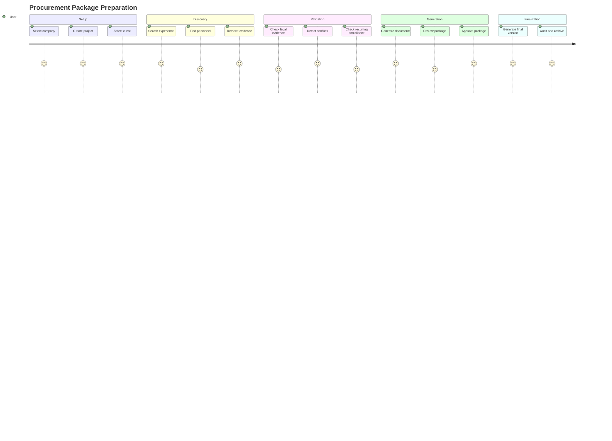
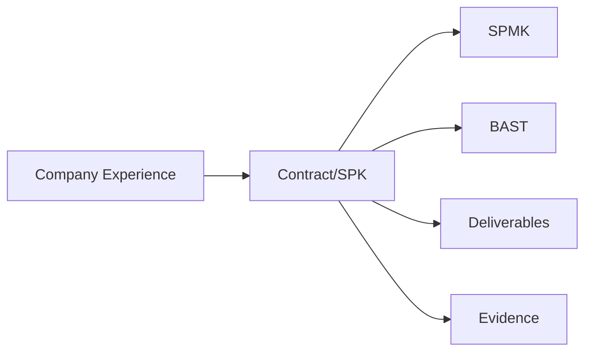
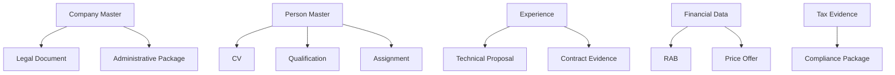
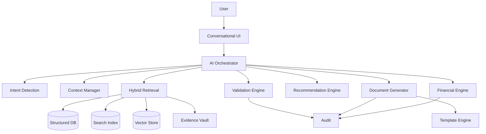

# PRODUCT REQUIREMENT DOCUMENT (PRD)

## AI-Powered Business & Procurement Knowledge Workspace

**Document Version:** 1.0  
**Status:** Draft  
**Document Type:** Product Requirement Document  
**Product:** Business & Procurement Knowledge Workspace  
**Date:** 2026-08-14

---

# 1. Product Vision

Build an AI-powered **Business Knowledge and Procurement Operating System** that allows users to manage companies, people, projects, experience, contracts, compliance, evidence, templates, financial data, and generated procurement documents through natural conversation.

The product should feel like chatting with a trusted and experienced business/procurement colleague.

The product is **not** merely an AI document generator.

Its core value is the ability to maintain structured, traceable, validated business knowledge and transform that knowledge into consistent procurement outputs.

```text
COMPANIES
    ↓
PEOPLE
    ↓
PROJECTS
    ↓
EXPERIENCE
    ↓
CONTRACTS
    ↓
COMPLIANCE
    ↓
EVIDENCE
    ↓
TEMPLATES
    ↓
DOCUMENTS
    ↓
VALIDATION
    ↓
APPROVAL
    ↓
AUDIT
```

---

# 2. Problem Statement

Business and procurement information is commonly scattered across PDFs, Word files, Excel files, scanned documents, CVs, SPK/contracts, BAST, SPMK, legal documents, tax documents, templates, and project folders.

Users must repeatedly:

- search for company information;
- find current legal documents;
- find appropriate company experience;
- identify suitable personnel;
- locate supporting contracts;
- verify tax evidence;
- copy data into templates;
- recalculate financial information;
- check consistency across documents;
- revise generated documents manually.

This creates operational risk and wastes time.

The product solves this by converting documents and conversations into structured knowledge while preserving evidence, provenance, temporal validity, versioning, permissions, and auditability.

---

# 3. Product Goals

## 3.1 Primary Goals

1. Create a single structured knowledge layer for business and procurement data.
2. Support multiple independent companies/vendors without data leakage.
3. Treat people as global entities with historical employment/association.
4. Create reusable company experience and contract repositories.
5. Create a dedicated compliance and evidence repository.
6. Preserve provenance for important facts.
7. Detect conflicts before document generation.
8. Support recurring compliance monitoring.
9. Generate consistent document packages from structured data.
10. Provide deterministic financial calculations.
11. Enable natural-language interaction.
12. Provide human approval before final output.

## 3.2 Secondary Goals

- Reduce document preparation time.
- Reduce manual copy-paste.
- Increase reuse of existing business knowledge.
- Improve evidence traceability.
- Improve document consistency.
- Improve procurement readiness.
- Reduce missed recurring compliance obligations.

---

# 4. Non-Goals

The product is not intended to be:

- a full ERP;
- a full accounting system;
- a payroll system;
- an autonomous legal advisor;
- a replacement for formal approval authority;
- an external procurement marketplace;
- a system that invents missing legal, financial, project, or personnel information.

---

# 5. Personas

## 5.1 Business Owner

Needs a high-level view of company readiness, documents, compliance, projects, and procurement opportunities.

## 5.2 Procurement/Admin Officer

Needs to quickly prepare qualification and procurement packages.

## 5.3 Project Manager

Needs to configure projects, assign personnel, select experience, and generate technical documents.

## 5.4 Finance User

Needs accurate and reproducible financial calculations.

## 5.5 Legal/Compliance User

Needs to verify legal and tax evidence.

## 5.6 HR/Personnel Administrator

Needs reusable personnel profiles and historical employment records.

## 5.7 Reviewer

Needs to inspect evidence, conflicts, generated documents, and provenance.

## 5.8 Approver

Needs to approve final documents and changes.

## 5.9 System Administrator

Needs to manage users, permissions, configurations, templates, and audit controls.

---

# 6. User Journey



---

# 7. Conversational UX

## 7.1 Core Principle

Users should not need to navigate through complex forms for common tasks.

They can say:

> "Gunakan CV Alfa Omega."

> "Buat project baru."

> "Project ini untuk Dinas Perikanan."

> "Pakai Agus sebagai Team Leader."

> "Cari pengalaman perusahaan yang paling relevan."

> "Gunakan legalitas yang masih berlaku."

> "Tambahkan BPE Juli."

> "Masukkan SPK 2022 sebagai bukti pengalaman."

> "Generate semua dokumen."

## 7.2 Context Model

The AI maintains:

- CURRENT COMPANY
- CURRENT PROJECT
- CURRENT CLIENT
- CURRENT PERSON
- CURRENT DOCUMENT
- CURRENT VERSION

If context is unambiguous, the AI uses it.

If context is ambiguous, the AI asks a targeted clarification.

## 7.3 Intent Types

Minimum supported intents:

- create
- update
- delete
- add
- use
- select
- search
- compare
- validate
- generate
- revise
- switch company
- switch project
- switch person
- reuse data
- recommend

---

# 8. Company Management

## 8.1 Functional Requirements

Users can:

- create company;
- update company;
- view company;
- switch active company;
- archive company;
- manage company identity;
- manage directors;
- manage ownership;
- manage legal documents;
- manage tax records;
- manage compliance;
- manage assets;
- manage services;
- manage branding.

## 8.2 Company Data

Minimum:

- legal name
- business type
- address
- phone
- email
- website
- directors
- commissioners
- partners
- owners
- ownership percentage
- legal documents
- tax records
- assets
- services
- logo
- letterhead
- signature
- stamp
- footer
- numbering pattern

## 8.3 Company Isolation

Company data must be isolated.

The system must never silently mix:

- identity;
- director;
- ownership;
- legal documents;
- tax records;
- branding;
- bank information;
- personnel assignment;
- project history;
- experience;
- contracts.

---

# 9. People Management

## 9.1 Global Person Model

People are global entities.

A person may have:

```text
Person A
 ├── Company A / 2020–2022
 ├── Company B / 2023–2024
 └── Company C / 2025–Present
```

## 9.2 Person Profile

Minimum:

- full name
- academic title
- position
- birth data
- education
- non-formal education
- language
- skills
- certifications
- employment history
- project history
- references
- CV
- identity documents
- supporting evidence

## 9.3 Employment History

Track:

- person
- company
- role
- employment status
- start date
- end date
- evidence
- source document

Statuses:

- Permanent
- Contract
- Non-permanent
- Consultant
- External
- Other

The system must not infer current employment solely from historical CV information.

---

# 10. Project Management

## 10.1 Project Entity

Minimum:

- project name
- company
- client
- location
- procurement category
- scope
- project dates
- assigned personnel
- selected experience
- required documents
- financial configuration
- status

## 10.2 Project Assignment

Assignment contains:

- project
- company
- person
- proposed position
- role
- responsibilities
- allocation
- start date
- end date
- duration
- status
- assignment evidence

Assignment must not modify the person's historical CV.

---

# 11. Company Experience Repository

## 11.1 Purpose

Provide a reusable, evidence-backed repository of company experience.

## 11.2 Experience Data

Minimum:

- company
- project name
- client
- location
- contract number
- contract date
- contract value
- start date
- end date
- handover date
- completion percentage
- procurement category
- scope
- client address
- contract evidence
- SPK evidence
- SPMK evidence
- BAST/reference evidence

## 11.3 Experience Recommendation

AI may recommend experience based on:

- project category;
- scope similarity;
- client/sector;
- time period;
- contract value;
- deliverables;
- available evidence.

Every recommendation must show:

- why selected;
- supporting evidence;
- missing evidence;
- confidence.

---

# 12. Contract / SPK Repository

A contract is structured business knowledge, not simply a PDF.

## 12.1 Extracted Fields

- contract/SPK number
- contract date
- project
- client/agency
- PPK
- provider
- contract type
- contract value
- duration
- start date
- end date
- location
- scope
- payment information
- penalty terms
- deliverables
- signatories
- supporting tables

## 12.2 Contract Relationship



---

# 13. Compliance & Tax Repository

The product must maintain a dedicated compliance knowledge layer.

Supported evidence includes:

- BPE
- SPT
- NPWP evidence
- tax payment evidence
- NIB
- SIUP
- TDP
- SBU
- deeds
- legal certificates
- other compliance evidence.

Each evidence record contains:

- company
- evidence type
- document number
- issue date
- tax period
- valid-from
- valid-until
- status
- source document
- source page
- extracted fields
- verification state

---

# 14. Recurring Compliance Management

The product must support recurring compliance obligations.

## 14.1 Surat Keterangan Bank

Default product configuration:

- frequency: annual;
- target period: January / early year;
- company-scoped;
- document year;
- issue date;
- bank;
- document number;
- source document;
- validity status.

The January target is an operational default and must remain configurable.

## 14.2 BPE

Default:

- frequency: monthly;
- company/tax scoped;
- tax year;
- tax period;
- BPE number;
- receipt date;
- submission channel;
- status;
- source evidence.

The product should provide a monthly view:

```text
BPE 2026
├── January
├── February
├── March
├── April
├── May
├── June
├── July
├── August
├── September
├── October
├── November
└── December
```

## 14.3 Annual Tax Report

Default:

- frequency: annual;
- tax year;
- target operational month: April;
- submission date;
- status;
- source evidence.

The product must distinguish **operational target date** from official/legal deadline. Official deadlines must be configurable and verified rather than hard-coded.

## 14.4 Compliance Calendar

The system must provide:

| Evidence | Frequency | Default Operational Target |
|---|---|---|
| Surat Keterangan Bank | Annual | January |
| BPE | Monthly | Every month |
| Annual Tax Report | Annual | April |

The calendar must show:

- target date;
- actual date;
- status;
- responsible person;
- reminder;
- escalation;
- evidence;
- notes.

## 14.5 Compliance Status

Minimum statuses:

- UPCOMING
- DUE
- OVERDUE
- MISSING
- SUBMITTED
- VERIFIED
- EXPIRED
- CONFLICTED
- UNVERIFIED

---

# 15. Evidence Vault

## 15.1 Purpose

Create a fact-to-evidence relationship.

Examples:

```text
Director → Deed
NIB → Legal Document
NPWP → Tax Document
Experience → SPK
Certification → Certificate
Tax Compliance → BPE
```

## 15.2 Evidence States

- CONFIRMED
- SUPPORTED
- INFERRED
- ASSUMED
- MISSING
- CONFLICTED
- EXPIRED
- UNVERIFIED
- POTENTIALLY OUTDATED

---

# 16. Provenance

Every important extracted or generated value should retain:

- source file;
- source page;
- source section;
- source table;
- source field;
- extraction timestamp;
- confidence;
- verification state.

User should be able to trace:

```text
Generated Value
   ↓
Structured Field
   ↓
Evidence
   ↓
Source Document
   ↓
Source Page
```

---

# 17. Temporal Validity

Sensitive entities require effective dating.

Examples:

- director valid from/to;
- employment start/end;
- company address start/end;
- tax year/period;
- document validity.

Historical documents must use historical context where supported.

---

# 18. Document Management

Supported document categories:

## Administrative

- Surat Penawaran
- Pakta Integritas
- Surat Pernyataan
- Surat Minat
- Surat Prakualifikasi
- Formulir Isian Kualifikasi
- Legalitas

## Technical

- Penawaran Teknis
- Metodologi dan Pendekatan
- Pengalaman Perusahaan
- Kualifikasi Tenaga Ahli
- Jadwal Penugasan
- Struktur Organisasi
- Manajemen Risiko
- Rencana Kerja

## Personnel

- CV
- Daftar Riwayat Hidup
- Surat Kesediaan
- Surat Penugasan
- Sertifikat
- Ijazah
- Referensi

## Financial

- Surat Penawaran Harga
- Rekapitulasi Biaya
- Daftar Kuantitas dan Harga
- Komponen Remunerasi
- RAB
- Pajak

## Contract/Evidence

- SPK
- SPMK
- BAST
- Contract Evidence
- Tax Evidence
- Legal Evidence

## Reporting

- Laporan Pendahuluan
- Laporan Akhir
- Manual Book
- Other deliverables

---

# 19. Template Engine

Templates are separate from business data.

Templates support:

- header;
- logo;
- letterhead;
- footer;
- tables;
- signatures;
- stamp;
- page numbering;
- dynamic sections;
- conditional sections;
- repeating sections;
- number formatting;
- date formatting.

Template versions must be immutable once used by an approved document version.

---

# 20. Document Generation

User can request:

> "Generate semua dokumen."

System behavior:

1. Resolve project context.
2. Determine required documents.
3. Retrieve structured data.
4. Retrieve evidence.
5. Validate.
6. Detect conflicts.
7. Detect missing fields.
8. Detect expired evidence.
9. Detect unsupported claims.
10. Request approval.
11. Generate.
12. Version.
13. Audit.

---

# 21. Document Dependency Graph

Generated documents must know which source data they depend on.

Example:



When source data changes, the system should be able to identify affected documents.

---

# 22. Financial Engine

The LLM must never be the final calculator.

The deterministic financial engine must support:

- quantity;
- unit;
- unit price;
- duration;
- person-month;
- billing rate;
- personnel cost;
- non-personnel cost;
- tax;
- total;
- rounding;
- number-to-words.

All calculations must be reproducible.

---

# 23. Search & Knowledge Retrieval

Search must support:

1. Keyword search
2. Semantic search
3. Structured filtering
4. Hybrid search

Example queries:

> "Cari pengalaman AOS terkait sistem informasi tahun 2020-2025."

> "Siapa programmer yang punya pengalaman aplikasi pemerintah?"

> "Tampilkan semua SPK AOS."

> "Dokumen pajak AOS yang tersedia tahun 2026?"

> "Pengalaman CV Solusi Bumi yang relevan dengan sistem pelayanan publik?"

---

# 24. Knowledge Separation

Knowledge scopes:

- COMPANY KNOWLEDGE
- PROJECT KNOWLEDGE
- PERSON KNOWLEDGE
- CONTRACT KNOWLEDGE
- COMPLIANCE KNOWLEDGE
- TEMPLATE KNOWLEDGE
- GENERATED DOCUMENT KNOWLEDGE

Each scope must have explicit retrieval boundaries.

---

# 25. AI Architecture



---

# 26. AI Capability Specifications

Every AI feature must define:

- Purpose
- Input
- Output
- Context
- Retrieval
- Model
- Prompt strategy
- Tools
- Validation
- Confidence
- Evaluation
- Failure modes
- Human approval
- Latency
- Cost
- Observability

## AI-001 Intent Detection

Identify user intent and required action.

## AI-002 Context Resolution

Resolve current company, project, client, person, document, and version.

## AI-003 Document Understanding

Extract entities, attributes, relationships, evidence, calculations, signatures, temporal data, and possible conflicts.

## AI-004 Evidence Retrieval

Find relevant source evidence.

## AI-005 Experience Matching

Recommend company experience based on evidence and project relevance.

## AI-006 Personnel Matching

Recommend personnel based on skills, qualifications, history, availability, and evidence.

## AI-007 Conflict Detection

Compare data across sources and identify contradictions.

## AI-008 Document Composition

Populate templates using validated structured data.

## AI-009 Conversational Guidance

Ask only for missing or ambiguous information.

## AI-010 Compliance Monitoring

Detect recurring compliance obligations and identify missing or overdue evidence.

---

# 27. AI Guardrails

The AI must never invent:

- company identity;
- ownership;
- directors;
- legal status;
- tax status;
- project history;
- contract number;
- contract value;
- person experience;
- certification;
- qualification;
- client;
- project requirement.

Unsupported information:

`MISSING`

Contradictory information:

`CONFLICT`

Inference:

`INFERRED`

Potentially outdated:

`POTENTIALLY OUTDATED`

Unverified:

`UNVERIFIED`

---

# 28. Validation Engine

Validation must operate at:

- field level;
- entity level;
- document level;
- project level;
- package level.

Validation checks include:

- required fields;
- data type;
- date validity;
- evidence existence;
- evidence expiration;
- company ownership;
- company scope;
- personnel qualification;
- contract consistency;
- project consistency;
- financial consistency;
- template compatibility.

---

# 29. Consistency Engine

Before package generation, compare:

- company;
- director;
- signatory;
- NPWP;
- NIB;
- address;
- client;
- project;
- location;
- fiscal year;
- dates;
- duration;
- person;
- position;
- experience;
- contract value;
- costs;
- tax;
- reference numbers;
- evidence.

A conflict must block or warn according to severity.

The system must never silently choose one conflicting value.

---

# 30. Permissions

Permission hierarchy:

```text
Organization
   ↓
Company
   ↓
Project
   ↓
Document
   ↓
Sensitive Attachment
```

Minimum roles:

- Admin
- Company Manager
- Procurement
- Project Manager
- Finance
- Compliance
- HR
- Reviewer
- Approver
- Auditor
- Read Only

---

# 31. Versioning

Objects requiring versioning:

- master data changes;
- documents;
- templates;
- generated packages;
- financial calculations;
- approval states.

Lifecycle:

```text
Draft
  ↓
Review
  ↓
Approved
  ↓
Generated
  ↓
Revised
  ↓
Archived
```

Historical versions must never be destroyed.

---

# 32. Approval

Approval is required before final package generation where configured.

Approval record:

- approver;
- timestamp;
- action;
- comment;
- version;
- affected documents.

---

# 33. Audit Trail

Audit events must capture:

- who;
- what;
- when;
- before;
- after;
- why;
- source;
- affected documents.

Example:

```text
Project value changed
        ↓
Financial recalculation
        ↓
RAB changed
        ↓
Price Offer affected
        ↓
Audit event
```

---

# 34. Data Model

Minimum logical entities:

```text
users
organizations

companies
company_identity
company_owners
company_directors
company_legal_documents
company_tax_records
company_compliance_evidence
company_assets
company_services

people
person_identity
person_education
person_certifications
person_employment_history
person_experience

projects
clients
locations
project_assignments
project_experience_links

company_experiences

contracts
contract_parties
contract_deliverables
contract_evidence

documents
document_templates
document_versions
document_dependencies

financial_items
financial_calculations
tax_rules

attachments
source_documents
source_evidence

compliance_schedules
compliance_occurrences
compliance_reminders

approvals
audit_logs
```

---

# 35. API Product Requirements

The product API should support:

- authentication;
- authorization;
- company management;
- people;
- projects;
- experience;
- contracts;
- evidence;
- compliance;
- documents;
- templates;
- financial calculations;
- search;
- AI operations;
- approvals;
- audit.

API design should include:

- REST/HTTP methods;
- request/response schemas;
- error codes;
- authentication;
- authorization;
- versioning;
- pagination;
- filtering;
- sorting;
- rate limiting;
- retries;
- idempotency;
- webhooks where applicable.

---

# 36. Security Requirements

The system contains sensitive company and personal information.

Must support:

- tenant isolation;
- RBAC;
- company-level authorization;
- project-level authorization;
- document-level authorization;
- sensitive attachment protection;
- encryption in transit;
- encryption at rest;
- secure document access;
- audit logs;
- version integrity;
- least privilege.

---

# 37. Observability

Monitor:

## Product

- active companies;
- active projects;
- documents generated;
- package completion;
- compliance status.

## AI

- intent accuracy;
- retrieval quality;
- extraction accuracy;
- hallucination rate;
- unsupported claim rate;
- recommendation precision;
- confidence calibration.

## Technical

- API latency;
- error rate;
- queue latency;
- document processing time;
- OCR performance;
- vector search latency;
- database performance.

---

# 38. AI Evaluation

AI evaluation must use representative scenarios.

Minimum test categories:

1. Company isolation.
2. Historical person employment.
3. Experience matching.
4. Contract extraction.
5. Tax evidence extraction.
6. Conflict detection.
7. Context resolution.
8. Document generation.
9. Unsupported claim detection.
10. Recurring compliance detection.

Important metrics:

- precision;
- recall;
- accuracy;
- groundedness;
- evidence coverage;
- false positive rate;
- false negative rate.

---

# 39. Testing Requirements

Testing levels:

- unit tests;
- integration tests;
- API tests;
- database tests;
- permission tests;
- security tests;
- document generation tests;
- calculation tests;
- AI evaluation tests;
- regression tests;
- UAT.

Special test cases:

- duplicate company;
- same person across companies;
- conflicting directors;
- expired NIB;
- missing BPE;
- missing annual tax report;
- missing bank certificate;
- conflicting contract values;
- historical project;
- incomplete CV;
- invalid calculation;
- unauthorized document access.

---

# 40. MVP

## MVP Must Have

- Multi-company
- Company master
- Person master
- Employment history
- Project master
- Project assignment
- Company experience
- Contract repository
- Compliance repository
- Evidence vault
- Provenance
- Hybrid search
- Conversational interface
- Context management
- Validation
- Conflict detection
- Document templates
- Document generation
- Versioning
- Audit
- RBAC
- Compliance calendar

## MVP Should Have

- OCR
- AI experience matching
- AI personnel matching
- deterministic financial engine
- approval workflow
- semantic search
- compliance reminders

## MVP Could Have

- advanced recommendation;
- advanced document layout analysis;
- automated package composition;
- AI quality dashboard.

## MVP Won't Have

- full ERP;
- payroll;
- full accounting;
- autonomous legal decision-making;
- external procurement marketplace.

---

# 41. Release Strategy

## Release 1 — Foundation

- Identity and authentication
- Company management
- Person management
- Project management
- Evidence vault
- Basic document storage

## Release 2 — Knowledge

- Experience repository
- Contract repository
- Compliance repository
- Provenance
- Search
- Temporal validity

## Release 3 — AI

- Conversational UX
- Intent detection
- Context resolution
- Document extraction
- Evidence retrieval
- Recommendations
- Conflict detection

## Release 4 — Document Automation

- Template engine
- Document generation
- Package generation
- Versioning
- Approval

## Release 5 — Intelligence

- Compliance monitoring
- Advanced recommendations
- Change impact analysis
- Procurement readiness scoring
- AI evaluation dashboard

---

# 42. Product Acceptance Criteria

## AC-001 Company Isolation

**Given** multiple companies exist  
**When** a user selects one company  
**Then** only authorized data for that company is retrieved.

## AC-002 Context

**Given** a current company and project are selected  
**When** user says "buat suratnya"  
**Then** the system resolves the correct context without unnecessary questions.

## AC-003 Provenance

**Given** a value is extracted from a document  
**When** the value is inspected  
**Then** the source document and page are shown when available.

## AC-004 Conflict

**Given** two sources contain different directors  
**When** the user generates a package  
**Then** the system identifies the conflict and does not silently choose a value.

## AC-005 Experience

**Given** a person worked at Company A  
**When** the person is assigned to Company B  
**Then** the historical Company A experience does not become Company B company experience.

## AC-006 Financial

**Given** quantity, price, duration, and tax are available  
**When** the total is calculated  
**Then** the deterministic calculation engine produces a reproducible result.

## AC-007 Compliance

**Given** the current month is July  
**When** July BPE is missing  
**Then** the compliance dashboard identifies the BPE as missing/due according to configuration.

## AC-008 Annual Compliance

**Given** a company has no current-year bank certificate  
**When** the annual compliance calendar reaches January  
**Then** the system creates or displays the annual requirement.

## AC-009 Annual Tax Report

**Given** the operational target for annual tax reporting is April  
**When** the current year reaches April  
**Then** the system identifies the annual report requirement as due according to configured rules.

## AC-010 Package

**Given** all required data is validated  
**When** the user approves generation  
**Then** the system generates the configured document package.

## AC-011 Audit

**Given** a project value changes  
**When** the change is saved  
**Then** an audit event is created and affected documents are identified.

---

# 43. Product Risks

| Risk | Severity | Mitigation |
|---|---:|---|
| Cross-company data leakage | Critical | Strong isolation and authorization |
| AI hallucination | Critical | Evidence-grounded generation |
| Incorrect extraction | High | Confidence + verification |
| Outdated evidence | High | Temporal validity |
| Missed recurring compliance | High | Calendar + reminders |
| Financial calculation errors | Critical | Deterministic engine |
| Template inconsistency | High | Template versioning |
| Unauthorized sensitive data access | Critical | RBAC + encryption |
| User overtrust in AI | High | Human approval |
| Knowledge inconsistency | High | Provenance + governance |

---

# 44. Product Success Metrics

## Business

- 50%+ reduction in average document preparation time target.
- Reduction in data inconsistency incidents.
- Increase in reuse of company experience.
- Increase in reuse of verified personnel profiles.
- Reduction in missed compliance evidence.

## Product

- Context resolution success rate.
- Search success rate.
- Document generation success rate.
- Evidence traceability coverage.
- Conflict detection coverage.
- User correction rate.

## AI

- Grounded response rate.
- Unsupported claim rate.
- Extraction accuracy.
- Recommendation precision.
- Hallucination rate.
- Evidence coverage.

Targets should be calibrated using production baseline data after MVP launch.

---

# 45. Roadmap

## Phase 1 — Data Foundation

Build:

- company;
- person;
- project;
- experience;
- contract;
- compliance;
- evidence;
- provenance.

## Phase 2 — Search and Validation

Build:

- hybrid search;
- filtering;
- temporal validity;
- conflict detection;
- compliance calendar.

## Phase 3 — Conversational AI

Build:

- intent;
- context;
- retrieval;
- recommendations;
- document understanding.

## Phase 4 — Document Automation

Build:

- templates;
- document generation;
- package generation;
- approval;
- versioning.

## Phase 5 — Intelligence

Build:

- procurement readiness;
- evidence gap prediction;
- advanced recommendations;
- impact analysis;
- enterprise integrations.

---

# 46. Definition of Done

A feature is considered complete when:

- business requirement is documented;
- functional behavior is defined;
- permission model is defined;
- validation is defined;
- error handling is defined;
- audit behavior is defined;
- relevant evidence/provenance is supported;
- acceptance criteria pass;
- automated tests pass;
- security checks pass;
- observability exists;
- documentation is updated.

---

# 47. Final Product Principle

The product must preserve this principle:

> **The AI is the conversational interface and reasoning assistant. Structured business data, evidence, deterministic calculations, validation, approval, and audit remain the operational foundation.**

The product should allow the user to work as naturally as:

```text
User:
"Gunakan CV Alfa Omega."

AI:
"CV Alfa Omega Solusindo dipilih sebagai current company."

User:
"Buat project baru untuk Dinas Perikanan."

AI:
"Siap. Saya membuat project baru dan menghubungkannya ke Dinas Perikanan."

User:
"Cari pengalaman yang paling relevan."

AI:
"Berikut 3 pengalaman paling relevan beserta evidence dan confidence."

User:
"Generate semua dokumen."

AI:
"Sebelum generate, ditemukan 1 BPE belum tersedia dan 1 konflik data direktur. Mohon verifikasi."
```

Dengan demikian, Business & Procurement Knowledge Workspace menjadi sistem yang mampu mengubah percakapan menjadi **structured, evidence-backed, validated, auditable procurement operations**.
